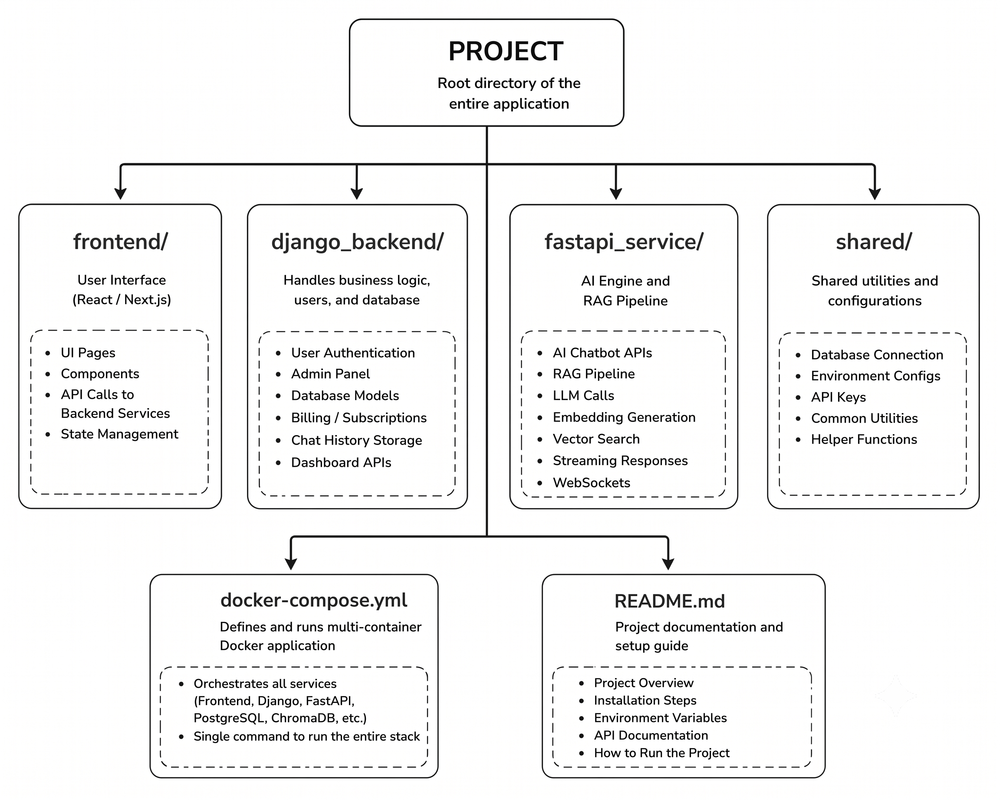
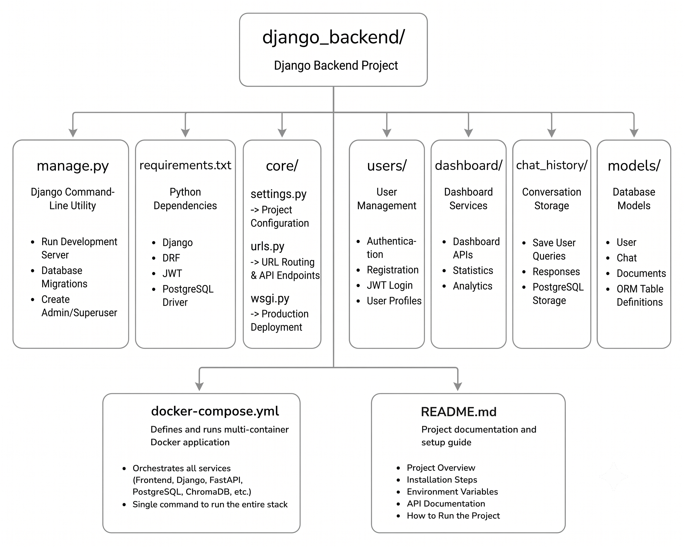
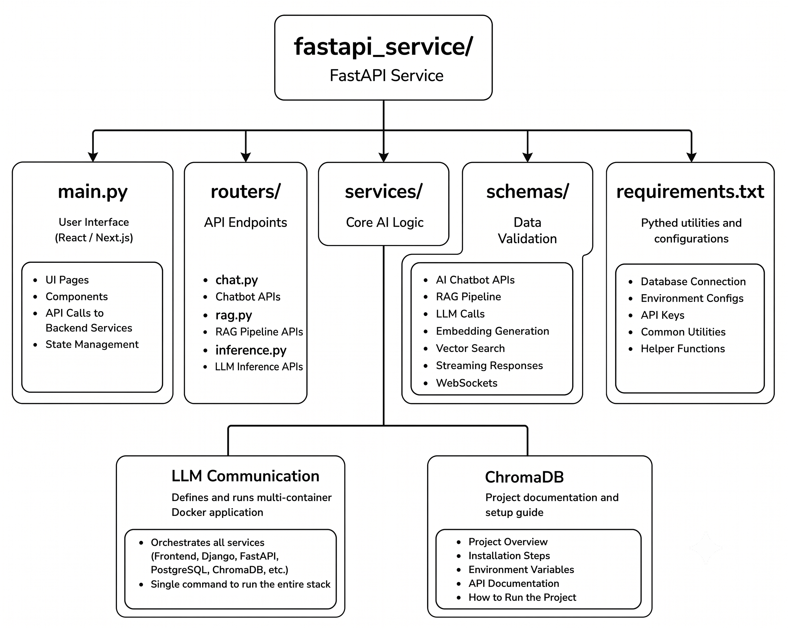
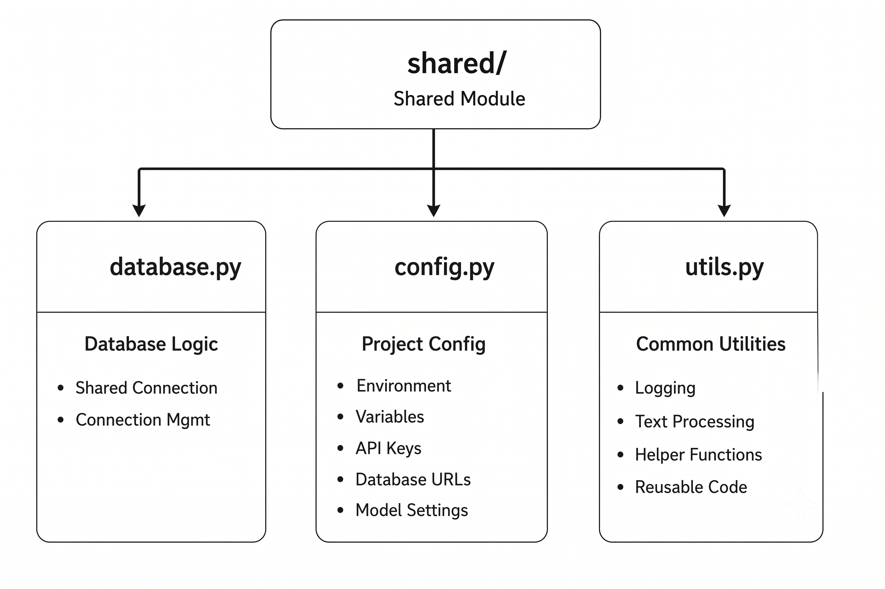
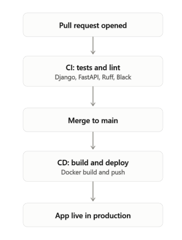

# File Structure and CI/CD Pipeline

## Introduction
This project follows a **modular, microservice-inspired architecture** based on the **Separation of Concerns (SoC)** principle, where each component has a specific responsibility. This makes the application easier to maintain, scale, debug, and allows multiple developers to work independently.

The project consists of four main components:
* **Frontend** – User Interface
* **Django Backend** – User management and application logic
* **FastAPI Service** – AI processing and RAG pipeline
* **Shared Module** – Common utilities and configurations

<br>

## Project Structure



<br>

### Folder Descriptions

#### 1. `frontend/`
The frontend (React/Next.js) provides the user interface and communicates with the backend through APIs.
* **Responsibilities:**
  * Login & Registration
  * Dashboard
  * Chat Interface
  * File Upload
  * Display AI Responses

#### 2. `django_backend/`
Django manages all business logic and database-related operations.



* **Why Django?** Django is ideal for:
  * Authentication
  * User Management
  * Admin Panel
  * Database Models
  * Billing & Subscriptions
  * Chat History Storage

#### 3. `fastapi_service/`
FastAPI acts as the **AI engine** of the application and handles all AI-related operations.



* **FastAPI Responsibilities:**
  * AI Chatbot APIs
  * RAG Pipeline
  * LLM Inference
  * Embedding Generation
  * Vector Search (ChromaDB)
  * Streaming Responses
  * WebSockets
* **Why FastAPI?** FastAPI is asynchronous and highly performant, making it better suited for AI inference than Django.

#### 4. `shared/`
Contains reusable modules used by both Django and FastAPI.



#### 5. `docker-compose.yml`
Docker Compose orchestrates all project services (Frontend, Django, FastAPI, PostgreSQL, ChromaDB) and allows the complete application to be started with a single command:
```bash
docker compose up
```
This ensures a consistent development and deployment environment.

#### 6. `README.md`
Provides project documentation, including: Project overview, Installation steps, Folder structure, Environment variables, API usage, and Running instructions.


<br>

## Summary

| Component | Responsibility |
| :--- | :--- |
| **Frontend** | User Interface and API communication |
| **Django Backend** | Authentication, user management, dashboard, database models, billing, chat history |
| **FastAPI Service** | AI chatbot, RAG pipeline, embeddings, vector search, LLM inference, streaming |
| **Shared** | Common database, configuration, and utility functions |
| **Docker Compose** | Runs all services together in a consistent environment |
| **README** | Project setup and documentation |

<br>

## CI/CD Pipeline — `ci.yml`

This project uses a GitHub Actions workflow that runs automatically on every pull request made into the `main` branch. It acts as a quality gate, ensuring no code is merged unless it passes all tests and formatting checks. The workflow runs three jobs in parallel:

1. **Django Tests:** This job validates the `django_backend/` service, which handles authentication, user management, and chat history. A temporary PostgreSQL database (using the `pgvector` image) is spun up for testing. Dependencies are installed, the `vector` extension is enabled, database migrations are applied, and the Django test suite is executed using `python manage.py test`. Dummy environment variables are used so no real credentials are required.
2. **FastAPI Tests:** This job validates the `fastapi_service/`, which powers the AI and RAG pipeline (embeddings, vector search, and LLM inference). Like the Django job, it uses a temporary pgvector-enabled PostgreSQL database. Dependencies are installed, and tests are run using `pytest`. A fake API key is used in place of the real OpenAI key so tests can run without needing actual API access.
3. **Lint & Format Check:** This job checks code quality across both backend services without needing a database. It uses **Ruff** to catch linting issues and **Black** (in check mode) to verify that code formatting follows project standards. If code isn't properly formatted or contains lint errors, this job fails.

**Purpose:** Together, these jobs ensure that every pull request is automatically tested and validated, both backend services are tested independently, and code quality is enforced before any changes are merged into the main branch. This improves code reliability and reduces the chances of bugs or broken builds reaching production.

<br>

## CD Pipeline — `cd.yml`

This project uses a GitHub Actions workflow that runs automatically whenever code is pushed or merged into the `main` branch. It automates the deployment process by ensuring that the Continuous Integration (CI) workflow has successfully completed before deploying the application. 

1. **Wait for CI:** This job acts as a safety check before deployment begins. It waits for the project's **CI workflow** (tests, linting, and formatting checks) to complete successfully for the latest commit. Using the `wait-on-check-action`, GitHub continuously monitors the CI status and prevents deployment if any tests or quality checks fail. This ensures that only validated and stable code is deployed.
2. **Deploy Django:** After the CI workflow passes, this job deploys the **Django backend** to **Render**. It triggers Render's deployment using a secure **Deploy Hook URL** stored as a GitHub Secret (`RENDER_DJANGO_DEPLOY_HOOK`). Render then pulls the latest code from the repository, rebuilds the Django application, applies any required updates, and deploys the new version.
3. **Deploy FastAPI:** Once CI has passed, this job also deploys the **FastAPI service** to **Render** using its own Deploy Hook (`RENDER_FASTAPI_DEPLOY_HOOK`). Render automatically rebuilds and deploys the AI service, including the chatbot APIs, RAG pipeline, embedding generation, vector search, and LLM inference components.

**Purpose:** Together, these jobs automate the deployment of both backend services after every successful merge into the `main` branch. The workflow ensures that deployment only occurs after all CI checks have passed, automatically updates both the Django and FastAPI services on Render, eliminates manual deployment steps, and helps keep the production environment reliable, consistent, and always synchronized with the latest tested code.

<br>


