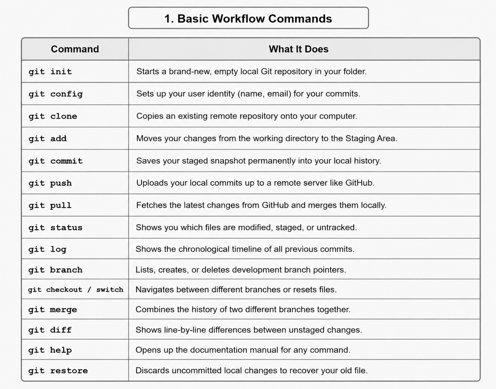
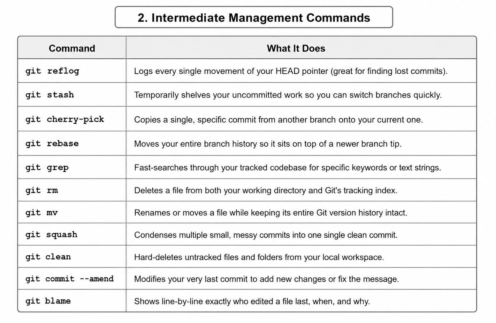
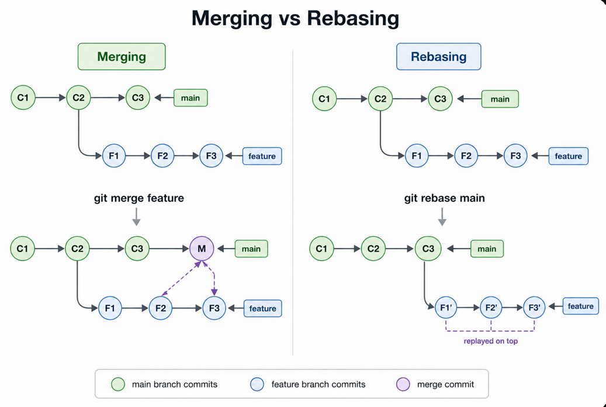
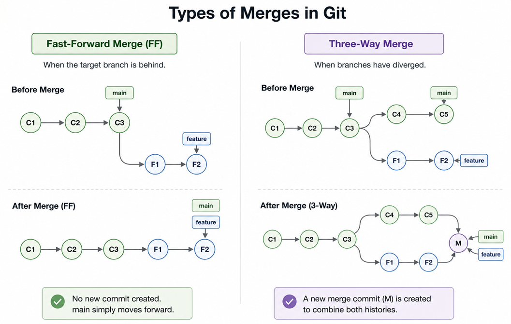
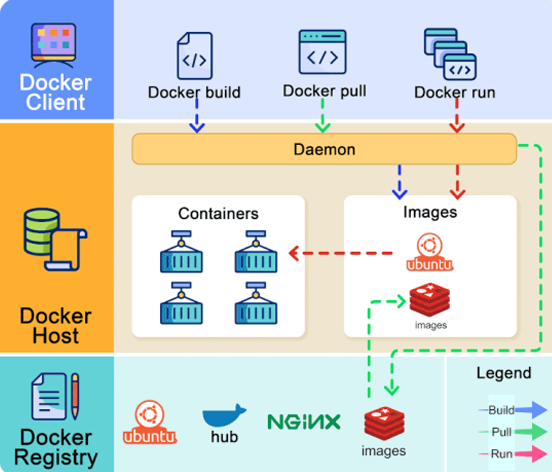

# Section 1: The Foundation (Operating Systems & Saving Your Work)

## 1.1 Why Everyone Uses Linux
Think of an operating system like the engine of a car. While most everyday users are accustomed to consumer operating systems, software engineers and cloud platforms overwhelmingly choose Linux to run their applications.

* **You’re in Total Control:** Linux is completely open-source. This means developers can look under the hood, modify any part of the core operating system, and fine-tune it to match their exact security and performance needs.
* **It Rarely Breaks:** Linux is famous for its rock-solid stability. It features a strict user-permission model and isolates running applications from one another. It can handle massive, complex workloads for months or even years without needing a random reboot.
* **It Doesn't Waste Resources:** Standard personal computers require a heavy graphical user interface (GUI)—with animations, windows, and mouse graphics—just to function. Linux can run completely as pure text. Because it doesn't waste energy on visual elements, all of your computer's RAM and CPU power go directly to running your application.

## 1.2 The Nightmare of Manual Saving (The Need for Version Control)
Before smart tools existed, managing progress on a software project was incredibly chaotic. Imagine writing code and saving your project folder over and over again to keep backups: `Project_Version_1`, `Project_Version_2_New_Idea`, `Project_Version_2_Johns_Edits`.

This manual approach quickly creates three massive bottlenecks:
1. **Wasted Storage Space:** You are duplicating the entire project codebase repeatedly, which rapidly clogs up your hard drive storage.
2. **Zero Visibility:** A list of folders tells you absolutely nothing about the inner history of the project. If a bug suddenly appears, you have no way of knowing who changed what line of code, when they did it, or why.
3. **The Merging Nightmare:** If two team members work on separate copies of the project at the same time, trying to stitch those folders back together manually into one final version is an error-prone nightmare.

A Version Control System (VCS) fixes all of this. Instead of duplicating folders, it acts like an ultra-smart security camera for your project. It watches your files, tracks every single tiny edit automatically, and provides a clear system to safely manage your code as it evolves.

---

# Section 2: Understanding Git Architecture

## 2.1 The Origin: The Linux Kernel and Git
To understand why Git is so fast and efficient, look at how it started. A brilliant engineer named Linus Torvalds created the Linux Kernel (the core engine of the Linux operating system). Because Linux is open-source, thousands of programmers around the world wanted to contribute code to it, causing the codebase to explode into tens of millions of lines of code.

The project management tools available at the time simply couldn't handle thousands of people changing the same massive project simultaneously. Out of frustration, Linus paused kernel development and built a brand-new tool from scratch specifically designed to handle decentralized tracking at speed. That tool was Git.

## 2.2 How Git Manages Commits and Branches
Instead of taking heavy snapshots of your folders, Git tracks your project using a clean, lightweight timeline system:

* **Commits (Checkpoints):** Think of a commit as a digital timestamp or a save-state in a video game. When you finish a small unit of work, you save a commit. Git captures that exact moment and assigns it a unique, cryptographic ID number (such as `6ec6c212` or `95c72c21`). If you ever break your project, you can instantly teleport back to any historic checkpoint.
* **Branches:** Imagine your project is a tree trunk (usually called the Main line). If you want to build a risky new feature without messing up the working code, you pull out a branch. This allows you to work in an isolated, parallel universe (like a `Feature 1` or `Feature 2` branch). You can write code freely, and when the feature is polished, you bring it back to the main trunk.

## 2.3 The Text Interface and the Three Internal Zones
While there are visual apps with buttons and menus for Git, most professional developers prefer using the Command Line Interface (CLI)—typing direct text instructions into a terminal. It is faster, gives you precise control, and operates universally across remote cloud servers that don’t have a visual interface.

When working locally on your machine, Git splits your workspace into three distinct conceptual zones to manage your changes cleanly:

* **Working Directory:** This is your actual project folder on your computer where you are currently typing, deleting, and editing files.
* **Staging Area (Index):** Think of this as a preparation zone or a packing table. Before saving a permanent checkpoint, you place specific changes here to tell Git, "I only want to bundle these exact files into my next save-state."
* **Local Repository:** Once you lock your changes in, they move into this hidden local database. It safely stores your entire historical timeline of checkpoints and metadata directly on your machine.

![Git Architecture Pipeline][git workflow.png]

### 2.4 Cryptographic Security via Hashing Algorithms
Git ensures total data integrity and prevents file tampering by using a Secure Hashing Algorithm (SHA).

* **What is a Hash Algorithm?** It is a mathematical formula that takes any amount of data—a single word or an entire textbook—and turns it into a unique, fixed-size string of characters. The magical part is that if you alter even a single space or character in the original file, the resulting hash string changes completely.
* **How Git Uses It:** Git hashes your files, folder structures, and commits to generate their IDs. Because every single checkpoint is mathematically tied to the exact content inside it, it is impossible for anyone to secretly alter old history or corrupt code without Git immediately noticing that the math doesn't add up.

### Core Workflow Reference Commands

### Intermediate Management Commands

---

# Section 3: Bringing Branches Together (Merging vs. Rebasing)
When team members work on different parallel branches, those branches eventually need to be brought back together. Git provides two distinct strategies to accomplish this:

 

## 3.1 Strategy 1: Merging (The Shared History)
Imagine you and a coworker split a project. You make two new checkpoints (A and B) on a feature branch, while they add a checkpoint (C) to the main trunk line. When you Merge, Git leaves both histories completely alone and binds them together using a brand-new, shared Merge Checkpoint.

* **Pros:** It preserves a completely honest, accurate history. You can look back in time and see exactly when a side feature was worked on and when it was brought into the team's main trunk.
* **Cons:** If you have a massive team with dozens of people merging branches every single day, your timeline graph can become tangled and difficult to look at.

* **Fast-Forward Merge (FF):** When the target branch is behind. No new commit is created; main simply moves forward to the tip of the feature branch.
* **Three-Way Merge:** When branches have diverged. A new merge commit (M) is created to combine both distinct histories.

## 3.2 Strategy 2: Rebasing (The Clean Rewrite)
Using the exact same scenario, if you choose to Rebase, Git does a bit of clever time travel. Instead of making a tie-in knot, Git temporarily lifts your feature branch checkpoints (A and B) into the air, lets the main trunk's updates (C) happen first, and then glues your checkpoints right back down on top of them.

* **Pros:** It completely erases the evidence that you ever worked on a separate side branch. Your project timeline looks like a perfectly straight, beautiful, easy-to-read line.
* **Cons:** It technically rewrites history. Because it shifts the starting base of your checkpoints to make it look like they happened later than they actually did, it can cause sync confusion if you rewrite history on a branch that other teammates are actively trying to share.

---

# Section 4: Modern Deployment, Containerization, and Orchestration

## 4.1 The Assembly Line (Pipelines and CI/CD)
Once your code changes are saved and combined in Git, they leave your laptop and move to live production servers via an automated assembly line called a Deployment Pipeline. This automated flow is driven by CI/CD:

* **Continuous Integration (CI):** Every time you push code to a shared platform, an automated system instantly grabs it, builds it, and runs tests to ensure nothing is broken. This catches bugs early.
* **Continuous Delivery (CD):** Once tests pass, the system automatically packages the application so that it is continually stable and ready to be deployed with minimal manual effort.
* **Continuous Deployment (CD):** Takes automation all the way to the finish line. It removes manual human approval entirely, automatically launching fully validated updates directly to your live users.

## 4.2 "It Works on My Machine!" (The Docker Solution)
A classic frustration in software development happens when code works perfectly on a developer's laptop but crashes the moment it is deployed to a production server. This happens because software depends heavily on dependencies—specific versions of code libraries, operating system configurations, and background tools. If the server’s environment differs even slightly from your laptop, things break.

Docker solves this environmental mismatch by packaging your application along with every single dependency, file, binary, and setting it needs to run. This self-contained bundle is called a container.

### Key Benefits of Docker:
* **Portability & Consistency:** A Docker container runs identically whether it is on a local developer laptop, a cloud instance, or an on-premise server. Build it once, run it anywhere.
* **Lightweight Efficiency:** Traditional Virtual Machines (VMs) require installing a heavy, separate operating system for every single application. Docker containers share the host computer's underlying Linux kernel instead. They start up in milliseconds and consume minimal system resources.

### Core Components of Docker Architecture:
* **Docker Client:** The primary text interface or terminal tool that developers use to give commands to the system.
* **Docker Host:** A background service (daemon) running on the machine that listens for commands and actively manages your containers, networks, and storage.
* **Docker Registry:** A centralized storage unit for sharing container setups. Docker Hub is a massive public registry where developers worldwide download and share pre-configured base environments instantly.

## 4.3 Scaling Up with Kubernetes
Docker is fantastic for managing individual application containers. However, if you are running a massive modern platform with hundreds of containers spread across multiple cloud servers, managing them manually becomes impossible.

This is where Kubernetes (or K8s) comes in. If Docker creates the individual shipping containers, Kubernetes acts as the automated port authority, cargo crane, and traffic controller.

Kubernetes is a container orchestration platform that automates the deployment and scaling of your containerized apps. If an application container crashes in the middle of the night, Kubernetes automatically tears it down and boots up a fresh one. If millions of users suddenly flood your website, Kubernetes dynamically spins up extra copies of your containers to balance the network traffic smoothly, keeping your application online and healthy around the clock.

[def]: git